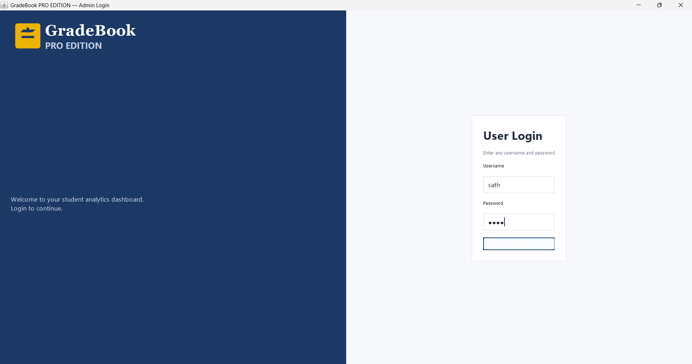
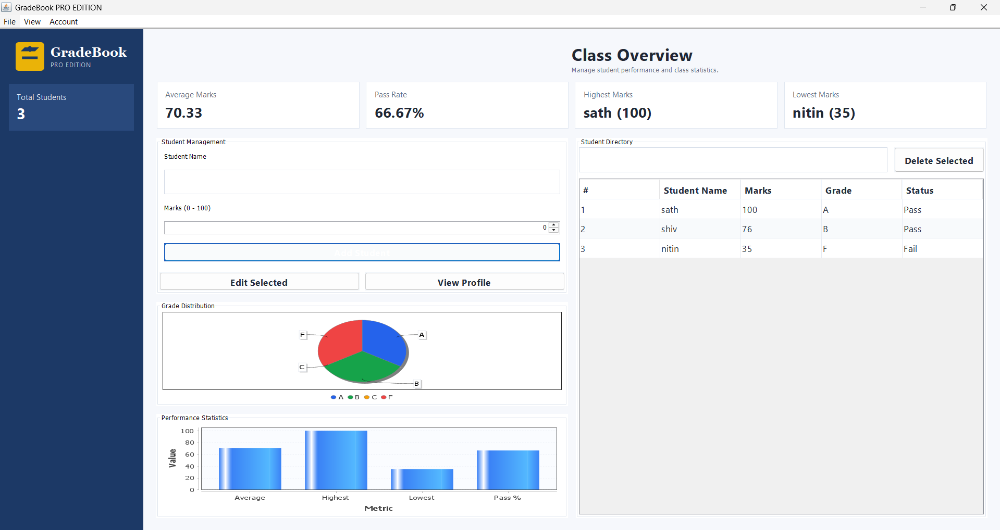
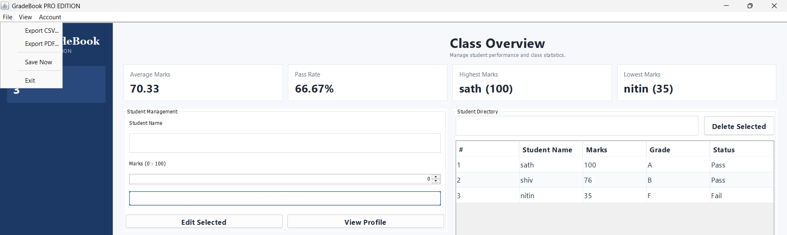
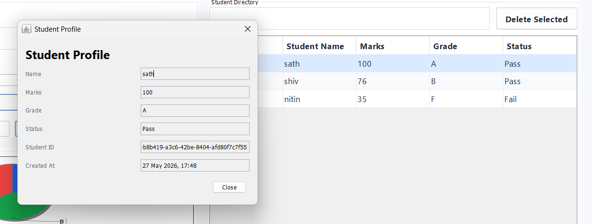
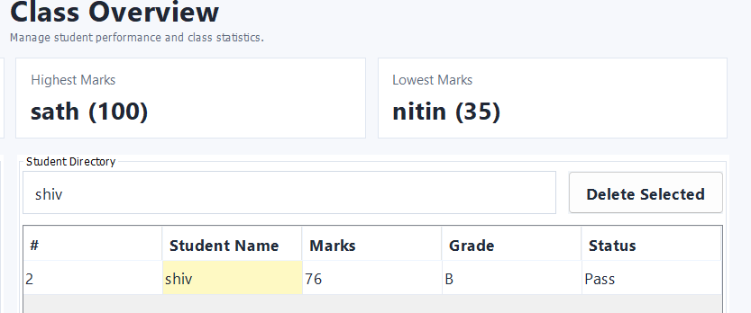
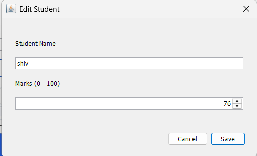
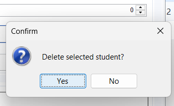
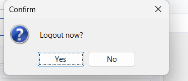
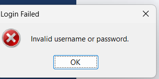

# 🎓 GradeBook PRO EDITION

A professional Java Swing desktop dashboard to manage student grades with Login/Logout, CRUD operations, Analytics, and Permanent Storage using file handling.

---

## ✨ Features

## 🔐 Login + Logout System
- Admin login page
- Username/password validation
- Secure logout from menu

## 👨‍🎓 Student Management (CRUD)
- Add student
- Edit selected student
- Delete selected student
- Dynamic search by name
- Student profile popup (double-click row)

## 📊 Grade System
- Automatic grade calculation (A, B, C, F)
- Pass/Fail status
- Average / Highest / Lowest marks

## 📈 Dashboard Analytics
- Total students card
- Pass percentage card
- Grade distribution chart
- Performance statistics visualization

## 💾 Permanent Storage (File Handling)
- Auto-load on startup
- Auto-save after every change
- Stores data in `data/students.csv`

## 📤 Export Features
- Export CSV
- Export PDF report

## 🌙 Dark Mode
- Toggle Dark Mode from:
  `View → Toggle Dark Mode`

---

## 🛠️ Tech Stack

- Java
- Java Swing
- JFreeChart
- ArrayList
- OOP Concepts
- File Handling

---

## 📁 Folder Structure

```text
CodeAlpha_StudentGradeTracker/
├─ data/
│  ├─ admin.properties
│  └─ students.csv
├─ screenshots/
├─ scripts/
│  └─ run_gui.bat
├─ src/
│  ├─ Student.java
│  ├─ StudentService.java
│  ├─ LoginFrame.java
│  ├─ DashboardFrame.java
│  ├─ GradeBookDashboardPanel.java
│  ├─ StudentEditDialog.java
│  ├─ StudentProfileDialog.java
│  ├─ FileStore.java
│  ├─ CsvUtil.java
│  ├─ PdfExporter.java
│  ├─ ThemeManager.java
│  ├─ Validator.java
│  └─ GradeTrackerGUI.java
├─ Main.java
└─ README.md
```

---

## ▶️ How to Run

## Requirements

* Java JDK 17+

## Run Application

Open terminal in project folder and run:

```bat
scripts\run_gui.bat
```

---

## 🔑 Admin Login

Admin credentials are securely stored in:

```text
data/admin.properties
```

On first launch, the application allows the administrator to create custom login credentials.

---

## 💽 Data Storage

Student records are stored in:

```text
data/students.csv
```

The application automatically:

* Loads data on startup
* Saves data after every change

---

## 📤 Export Options

Available from menu:

* `File → Export CSV...`
* `File → Export PDF...`

---

## 🧠 Beginner Explanation

### Frontend (UI)

Built using Java Swing:

* `LoginFrame`
* `DashboardFrame`
* `GradeBookDashboardPanel`

### Backend (Logic)

Handled using:

* `StudentService`
* ArrayList operations
* Analytics calculations

### Storage Layer

Managed using:

* `FileStore`
* CSV file handling
* Admin credential storage

### Utilities

* `Validator`
* `CsvUtil`
* `PdfExporter`
* `ThemeManager`

---

## 📄 Sample Report Output

```text
========================================
          GRADEBOOK SUMMARY REPORT
========================================

Total Students : 3
Average Marks  : 70.33
Pass Percentage: 66.67%
Highest Marks  : sath (100)
Lowest Marks   : nitin (35)

--- All Students ---
1) sath            100   Grade: A
2) shiv             76   Grade: B
3) nitin            35   Grade: F
```

---

## 📝 Notes

* Marks are restricted to 0–100 using a spinner.
* This is a 100% Java desktop application.
* No web frontend/backend is used.

---

## 📸 Screenshots

### Login Screen



### Main Dashboard



### Export Menu



### Student Profile



### Search Feature



### Edit Student



### Delete Confirmation



### Logout Popup



### Invalid Login Popup



---

## 🚀 Future Improvements

* MySQL database integration
* Advanced PDF report generation
* Attendance management
* Student profile images
* Leaderboard system
* Semester-wise analytics
* Role-based authentication

---

## 🎯 Project Purpose

This project was developed as a professional Java Swing desktop application for:

* Internship showcase
* GitHub portfolio
* Resume projects
* Mini/Major project demonstration
* Learning Java GUI + OOP concepts

---

## 👨‍💻 Developer Information

Sathwikadondapati25
B.Tech CSE Student
Java & Software Development Enthusiast